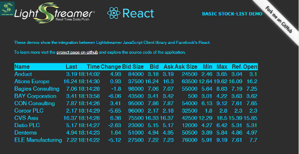

# Lightstreamer - Basic Stock-List Demo - HTML (React) Client

A simple stocklist demo application showing integration between [React](https://facebook.github.io/react/index.html) and the <b>Lightstreamer JavaScript Client library</b>.

## Live Demo

 
### [ View live demo](http://demos.lightstreamer.com/ReactDemo) 

## Details

This demo displays real-time market data for ten stocks, generated by a feed simulator in a similar way to the [Lightstreamer - Basic Stock-List Demo - HTML Client](https://github.com/Lightstreamer/Lightstreamer-example-StockList-client-javascript#basic-stock-list-demo---html-client). 

This page uses the <b>JavaScript Client API for Lightstreamer</b> to handle the communications with Lightstreamer Server and uses <b>React</b> to display the real-time data pushed by Lightstreamer Server.

Each row in the table is implemented as an instance of a React class. The state of these instances is then refreshed through the onItemUpdate callback implementation called by
an associated Lightstreamer Subscription; check the Stock.js class to see how this is done.

The demo includes the following client-side functionalities:
* A [Subscription](https://lightstreamer.com/api/ls-web-client/latest/Subscription.html) containing 10 items, subscribed to in **MERGE** mode.

## JSX

You will notice that in the sources of this demo there is a jsx folder. This folder contains classes in the jsx format that are then transformed into plain js by [Babel](https://babeljs.io/) and
copied into the js folder. When modifying this demo you can either act on the jsx version of these classes or on the js version. If you choose to edit the jsx files you will have to keep them
aligned with the js folder using the aforementioned Babel:

Install babel
`npm install -g babel`

Automatically convert the jsx file to js whenever a change is made
`babel --watch src/jsx --out-dir src/js`

## Install

If you want to install a version of this demo pointing to your local Lightstreamer Server, follow these steps:

* Note that, as prerequisite, the [Lightstreamer - Stock- List Demo - Java Adapter](https://github.com/Lightstreamer/Lightstreamer-example-Stocklist-adapter-java) has to be deployed on your local Lightstreamer Server instance. Please check out that project and follow the installation instructions provided with it, then launch the server.
* Get the `lightstreamer.min.js` file from [npm](https://www.npmjs.com/package/lightstreamer-client-web) or [unpkg](https://unpkg.com/lightstreamer-client-web/lightstreamer.min.js) and put it in the `src/js` folder.
* Deploy this demo on the Lightstreamer Server (used as Web server) or in any external Web Server: copy there the contents of the `/src` folder of this project. The client demo configuration assumes that Lightstreamer Server and this client are launched on the same machine. If you need to target a different Lightstreamer server, please open the `src/js/Constants.js` and configure the SERVER element accordingly.
* RequireJS and React are currently hot-linked in the html page: you may want to replace them with a local version and/or to upgrade their version.
* Open your browser and point it to to the newly deployed folder.

## See Also

### Lightstreamer Adapters Needed by This Demo Client

* [Lightstreamer - Stock-List Demo - Java Adapter](https://github.com/Lightstreamer/Lightstreamer-example-Stocklist-adapter-java)
* [Lightstreamer - Reusable Metadata Adapters - Java Adapter](https://github.com/Lightstreamer/Lightstreamer-example-ReusableMetadata-adapter-java)

### Related Projects

* [Lightstreamer - Stock-List Demos - HTML Clients](https://github.com/Lightstreamer/Lightstreamer-example-Stocklist-client-javascript)

## Lightstreamer Compatibility Notes

- Compatible with Lightstreamer JavaScript Client library version 6.0 or newer (installation instructions for version 8.0 or newer).

