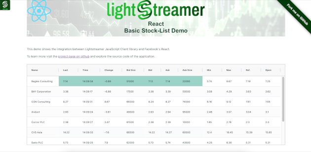

# Lightstreamer - Basic Stock-List Demo - HTML (React) Client

A simple stocklist demo application showing integration between [React](https://react.dev) and the <b>Lightstreamer JavaScript Client library</b>.

## Live Demo

[](https://demos.lightstreamer.com/ReactDemo/)<br>
### [ View live demo](https://demos.lightstreamer.com/ReactDemo/)<br>

## Details

This demo displays real-time market data for ten stocks, generated by a feed simulator in a similar way to the [Lightstreamer - Basic Stock-List Demo - HTML Client](https://github.com/Lightstreamer/Lightstreamer-example-StockList-client-javascript#basic-stock-list-demo---html-client).<br>

This page uses the <b>JavaScript Client API for Lightstreamer</b> to handle the communications with Lightstreamer Server and uses <b>React</b> to display the real-time data pushed by Lightstreamer Server.

A Lightstreamer Subscription is used for subscribing to the data. The onItemUpdate callback implementation fills an object that is used by React to populate the HTML.

The demo includes the following client-side functionalities:
* A [Subscription](https://lightstreamer.com/api/ls-web-client/latest/Subscription.html) containing 10 items, subscribed to in **MERGE** mode.

## Install

If you want to install a version of this demo pointing to your local Lightstreamer Server, follow these steps:

* Note that, as prerequisite, the [Lightstreamer - Stock- List Demo - Java Adapter](https://github.com/Lightstreamer/Lightstreamer-example-Stocklist-adapter-java) has to be deployed on your local Lightstreamer Server instance. Please check out that project and follow the installation instructions provided with it.
* Launch Lightstreamer Server.
* Change the current directory to the location of the file `package.json` and issue the commands `npm install` (to install React libraries) and `npm run build` (to compile Typescript files). Be sure to have installed [Node.js and npm](https://nodejs.org/en/download/).

You can deploy this demo inside Lightstreamer internal web server or in any other web server.
If you choose the former, please create the folders `/pages/demos/[demo_name]` into your Lightstreamer server installation then copy the contents of the `dist` folder of this project there.

The client demos configuration assumes that Lightstreamer Server, Lightstreamer Adapters, and this client are launched on the same machine. If you need to target a different Lightstreamer server, please search for this line:
```js
this.client = new LightstreamerClient
```
in `App.tsx` and change it accordingly.

The demo is now ready to be launched.

## See Also

### Lightstreamer Adapters Needed by This Demo Client

* [Lightstreamer - Stock-List Demo - Java Adapter](https://github.com/Lightstreamer/Lightstreamer-example-Stocklist-adapter-java)
* [Lightstreamer - Reusable Metadata Adapters - Java Adapter](https://github.com/Lightstreamer/Lightstreamer-example-ReusableMetadata-adapter-java)

### Related Projects

* [Lightstreamer - Stock-List Demos - HTML Clients](https://github.com/Lightstreamer/Lightstreamer-example-Stocklist-client-javascript)

## Lightstreamer Compatibility Notes

* Compatible with Lightstreamer Web Client library version 9.0 or newer.
* For Lightstreamer Server 7.3.2 or newer. Ensure that Web Client API is supported by Lightstreamer Server license configuration.
* For a version of this example compatible with Lightstreamer SDK for Web Clients version 8.x or earlier, please refer to [this tag](https://github.com/Lightstreamer/Lightstreamer-example-StockList-client-react/releases/tag/latest-for-client-8.x).
